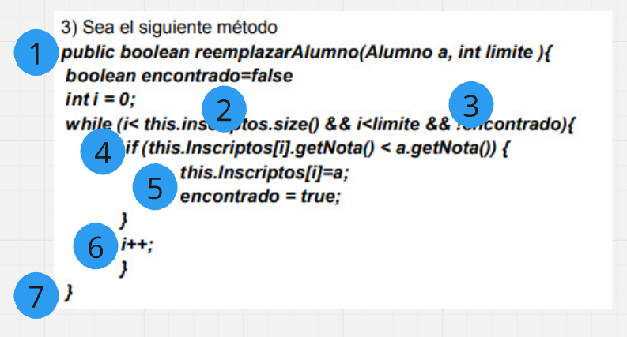
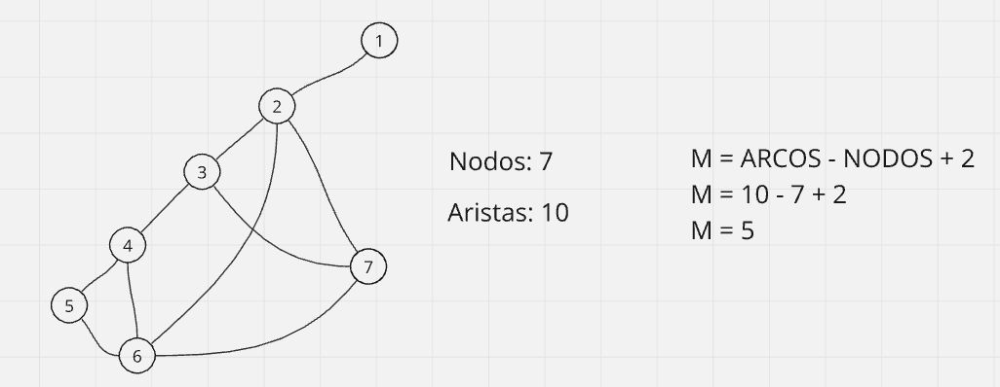
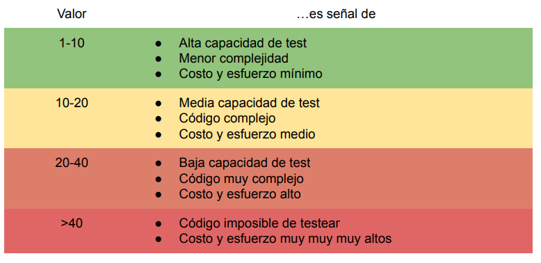
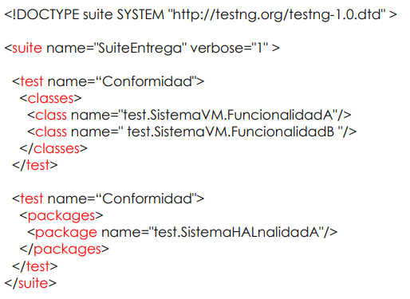

# Parcialito nro 2 Técnicas de Documentación y Validación
## Validación Estática
### Aserciones
- Es una condición lógica insertada en el código que se asume cierta (según especificación). El sistema se encarga de comprobarlas y lanzar excepciones en caso de no cumplirse.
- Útil en implementación y testeo.
- Útil para debuging de un código en producción que está causando problemas.

#### Ejemplo
```java
public class AssertExample {
    public static void main(String[] args) {
        int x = 10;
        int y = 5;

        // Usamos assert para verificar que y no sea 0 antes de hacer la división
        assert y != 0 : "El valor de y no puede ser 0";
        
        // Si el assert es verdadero, se ejecuta esta línea
        int resultado = x / y;
        System.out.println("Resultado: " + resultado);
    }
}
```

### Linting
- Es una técnica de análisis estático.
- Encuentra errores cuando estamos escribiendo código.
- Busca estructuras sospechosas.
- Utilizado por los compiladores para realizar optimizaciones.
- Ejemplos:
    - Variables que pueden exceder su rango.
    - índices de arreglos fuera de límites.
    - Pérdida de precisión.
    - Uso de variables sin inicializar.
    - Variables sin utilizar.

## Testing
Tarea de probar que un programa realiza lo que se supone que debe hacer.

### Testing no funcionales
- Test de Humo
- Test de Facilidad
- Test de Volumen
- Test de Stress
- Test de Usabilidad
- Test de Seguridad
- Test de Performance
- Test de Configuración
- Test de Compatibilidad
- Test de Instalabilidad
- Test de Confiabilidad
- Test de Recuperación
- Test de Documentación
- Test de Mantenibilidad

### Regression Test VS Retest
#### Regression Test
- Realizado para corroborar que un cambio no afectó las características que ya funcionaban.
- No se orienta a la verifcación de defectos.
- Según la disponibilidad de defectos se puede ahcer a la vez que el re-testing.
- Se realiza sobre casos de test ya pasados.
- Los casos de test pueden extraerse la especificación funcional, información del usuario, manuales y reportes inherentes a problemas ya corregidos.

#### Retest
- Re-test es para corroborar que los defectos de un código han sido solucionados.
- Se orienta a la detección de defectos.
- Tiene mayor prioridad.
- Sólo se realiza sobre los casos que presentan fallas.
- No se sabe que se deberá testear.

### Agile Testing - Cuadrantes
#### Cuadrante 1: Pruebas unitarias y componentes.
**Test que guían el desarrollo**
- Enfoque: Técnico, pruebas automáticas.
- Propósito: Asegurar la funcionalidad técnica correcta y la calidad interna del código.
- Tipo de pruebas:
    - Pruebas unitarias: Aseguran que unidades individuales de código (métodos, funciones, clases) funcionan correctamente.
    - Pruebas de componentes: Verifican que diferentees componentes de software funcionen juntos.
- Responsabilidad: Generalmente son desarrolladores los que escriben estas pruebas.

#### Cuadrante 2: Pruebas funcionales y exploratorias.
**Test que guían el negocio**
- Enfoque: Enfocado al negocio, pruebas automáticas y manuales.
- Propósito: Asegurar que el software funcione de acuerdo con los requisitos del cliente y satisfaga las necesidades del negocio.
- Tipo de pruebas:
    - Pruebas de aceptación: Verifican que las funcionalidades cumplen con los criterios de aceptación definidos por el cliente o el Product Owner.
    - Pruebas de historia de usuario: Evalúan si cada historia de usuario está implementada correctamente.
    - Pruebas exploratorias: Los testers investigan el sistema de forma creativa, buscando posibles fallas que no hayan sido contempladas en las pruebas automatizadas.
- Responsabilidad: Los desarrolladores y testers trabajan juntos para escribir pruebas de aceptación automatizadas.

#### Cuadrante 3: Pruebas exploratorias, usabilidad y experiencia del usuario.
**Test que validan el negocio**
- Enfoque: Enfocado al negocio, pruebas manuales.
- Propósito: Validar la calidad del producto desde la perspectiva del usuario.
- Tipo de pruebas:
    - Pruebas de usabilidad: Evalúan si el producto es fácil de usar para los usuarios finales.
    - Pruebas de accesibilidad: Verifican si el software es accesible para personas con discapacidades.
    - Pruebas de User Experience (UX): Analizan la satisfacción del usuario al interactuar con el sistema.
- Responsabilidad: Los testers, diseñadores de UX y usuarios finales suelen realizar este tipo de pruebas.

#### Cuadrante 4: Pruebas de rendimiento, seguridad y otros atributos no funcionales.
**Test que validan la calidad técnica**
- Enfoque: Técnica, pruebas automáticas y manuales.
- Propósito: Asegurar que el sistema cumpla con atributos de calidad no funcionales.
- Tipo de pruebas:
    - Pruebas de rendimiento: Evalúan cómo el sistema se comporta bajo diferentes condiciones de carga.
    - Pruebas de seguridad: Aseguran que el sistema esté protegido contra vulnerabilidades y ataques.
    - Pruebas de escalabilidad: Verifican si el sistema puede manejar un aumento en la carga de trabajo.
    - Pruebas de recuperación: Evalúan cómo el sistema se recupera de fallos o interrupciones
- Responsabilidad: Equipos de testing especializados, como ingenieros de pruebas de rendimiento o seguridad, suelen ser los encargados.

### Complejidad Ciclomática
- Medida para evaluar la complejidad estructural de un programa o función.
- Basado en el grafo descrito por el flujo del programa o función.
- Identificar y contar regiones independientes.
- Permite evaluar secciones de código complejas que podrían ser refactorizadas o bien conocer el número de casos de pruebas.

**Se calcula como:** M = E - N + 2P

**Donde**
- E = nro de arcos en el grafo.
- N = nro de nodos en el grafo.
- P = nro de componentes conectados.

#### Ejemplo de construcción del grafo y calculo



#### Complejidad Ciclomática Como Métrica


### Plan de Testeo: 5W´s / 1H
Técnica utilizada en redacción de noticias para obtener una historia completa. La historia se considera completa si puede responder a 6 preguntas básicas:

- W - WHY?
- W - WHAT?
- W - WHERE?
- W - WHEN?
- W - WHO?
- H - HOW?

#### W - WHY?
Establecemos el objetivos del sprint o bien el conjunto de requerimientos que queremos cumplir.

#### W - WHAT?
Se establece:
- Que requerimientos a testear.
- Cuando se debe realizar un test de regresión.
- Cuáles artefactos se van a testear y cuales no.

#### W - WHERE?
Se establece el ambiente inicial e información complementaria:
- Bases de datos de prueba.
- APIs de apoyo.
- Sala física/virtual.

#### W - WHEN?
Se establece parámetros de tiempo:
- Fecha estimada.
- Fecha límite.
- Posibles retrasos.
- Tiempo estimado.

#### W - WHO?
Se establece la participación de personas:
- Listado de personas.
- Listado de roles.
- Listado de responsabilidades.

#### H - HOW?
Se establece procesos y metodologías:
- Qué se va a hacer manual y que se va a automatizar.
- Prioridades y dependencias.
- Estimación de tiempos y recursos.

### Buenas prácticas en la escritura de casos de test
1. Los casos de test deben ser simples y transparentes
2. Crear casos de tests pensando como lo haría el usr final
3. Evitar casos de test repetidos
4. No asumir funcionalidades y características
5. Apuntar al 100% de cobertura
6. Los casos de tests deben ser identificables
7. Implementar técnicas de testeo
8. Autónomo (apertura y clausura)
9. Repetible
10. Aplicar revisión de pares

## Testing de Unidad
Prueba utilizada para comprobar el correcto funcionamiento de una unidad.

### Características
- Automatizable.
- Completo.
- Repetibles.
- Independientes.
- Rápidos de crear.
- Medibles.

### Enfoques
- Código embedido en la aplicación: El test se codifica dentro del código principal y se elimina al pasar a producción.
- Código aislado: El programador prueba una porción de código en otra parte. Sirve para identificar dependencias innecesarias.
- Uso de Frameworks.

### Herramientas
- **JUnit**: Entorno de pruebas para Java. Se encuentra basado en SUnit creado originalmente para realizar pruebas unitarias para el lenguaje Smalltalk.
- **TestNG**: Creado para suplir algunas deficiencias en JUnit.

### JUnit
- Framework que permite realizar la ejecución de clases Java de manera controlada, y de esta forma evaluar si cada uno de los métodos de la clase funcionan correctamente.
- Útil en pruebas de regresión.
- Código Java.
- Basado en los patrones Command y Composite.
- La clase que posee métodos para testear debe extender de TestCase.
- La clase debe implementar los métodos setUp() y tearDown().
- Los métodos a testear van con el nombre TEST_SetProperties().

#### Asserts
- **assertTrue(expresión):**: Comprueba que expresión evalúe a true.
- **assertFalse(expresión):**: Comprueba que expresión evalúe a false.
- **assertEquals(esperado, real):**: Comprueba que esperado sea igual a real.
- **assertNull(objeto):**: Comprueba que objeto sea null.
- **assertNotNull(objeto):**: Comprueba que objeto no sea null.
- **assertSame(objeto_esperado, objeto_real):**: Comprueba que objeto_esperado y objeto_real sean el mismo objeto.
- **assertNotSame(objeto_esperado, objeto_real):**: Comprueba que objeto_esperado y objeto_real no sean el mismo objeto.

#### JUnit 5 (Jupiter)
- **@TestFactory**: El método es un TestFactory para test dinámicos.
- **@DisplayName**: Define un nombre amigable.
- **@Nesteg**: Indica que la clase es una clase anidada no estática.
- **@Tag**: Indica etiquetas para filtrar los test.
- **@ExtendWith**: El método es un TestFactory para test dinámicos.
- **@BeforeEach/@AfterEach**: Indica que el método debe ejecutarse antes/después de cada test.
- **@BeforeAll/@AfterAll**: Indica que el método debe ejecutarse antes/después de todos los test de la clase (@BeforeClass/AfterClass de JUnit 4).
- **@Disable**: Deshabilita una clase o método (@Ignore JUnit 4).

### TestNG
- Framework inspirado en JUnit y NUnit.
- Aplicable desde testeo de unidad hasta testeo de integración.
- Provee soporte para anotaciones.
- Test dirigido por datos.
- Test parametizables.
- Uso de funciones JDK estándares.
- Se agrega información de los tests en un archivo XML (testng.xml o build.xml).
- Tags
    - < suite > Puede contener uno o más tests.
    - < test > Puede contener una o más clases.
    - < class > Una clase TestNG que puede contener uno o más métodos (@Test)

#### TestNG - Anotaciones
- **@BeforeSuite**: El método se ejecutará antes de los tests.
- **@AfterSuite**: El método se ejecutará después de los tests.
- **@BeforeTest**: El método se ejecutará antes de cualquier test dentro < test >.
- **@AfterTest**: El método se ejecutará después de cualquier test dentro < test >.
- **@BeforeGroups**: El método se ejecutará una vez antes del primer test del grupo.
- **@AfterGroups**: El método se ejecutará al finalizar todos los test del grupo.
- **@BeforeClass**: El método se ejecutará antes de cualquier método dentro de la clase que sea invocado.
- **@AfterClass**: El método se ejecutará luego que todos los métodos de la clase hayan sido invocados.
- **@BeforeMethod**: El método se ejecutará antes de cada método del test.
- **@AfterMethod**: El método se ejecutará luego de cada método del test.
- **@DataProvider**: Método proveedor de datos.
    - Devuelve un Object[][] donde cada elemento [] puede representar una lista de parámetros. El @Test que lo usará deb usar el name del dataProvider.
- **@Factory**: Objetos que serán usados por clases TestNG. Retorna Object[].
- **@Listeners**: Listeners de una clase test.
    - value Arreglo de clases qye extienden de org.testing.ITestNGListener.
- **@Describe**: Como se pasan parámetros a un método @Test
    - value Lista de variables para los parámetros del método.
- **@Test**: Marca una clase/método como parte del test.
    - alwaysRun: El método se ejecutará aun cuando fallen los anteriores.
    - dataProvider: Nombre del proveedor para este método.
    - dataProviderClass: Clase donde buscar el dataProvider.
    - dependsOnGroup: Lista de grupos que dependen de este método.
    - description: Descripción de este método.
    - enabled: Métodos de esta clase están habilitados o no.
    - expectedExceptions: Lista de escepciones que se esperan recibir.
    - groups: Lista de frupos a los cuales pertenece el método.
    - invocationCount: Número de veces que se invocará el método.
    - invocationTimeOut: Tiempo máxmio para ejecutar invocationCount.
    - priority: Prioridad del método (bajo número, alta prioridad).
    - successPercentage: Porcentaje esperado de éxitos.
    - singleThreaded: Todos los métodos de la calse se ejecutarán en un único hilo.
    - timeOut: Tiempo que tomará como máximo el test.

#### Modificadores
- **alwaysRun**
    - @Beforex (excepto groups) Se ejecutará independientemente a que grupo pertenezca.
    - @Afterx Se ejecutará independientemente que los métodos anteriores hayan fallado o ignorados.
- **dependsOnGroups**: Grupos a los cuales depende el método.
- **dependsOnMethod**: Métodos de los cuales depende el método.
- **enabled** des/habilita la ejecución de los métodos de la clase.
- **Groups**: Grupos a los cuales pertenece la clase/método.
- **inheritGroups**: Indica si el método heredará los grupos especificados en @Test.

#### Ejemplo TestNG


#### Ejemplo TestNG Parcialito 2023
- Dado un sistema de reservas de vuelos que aún se encuentra en desarrollo, se desea comenzar con la escritura de los test. Resolver indicando si es posible solucionarlo en JUnit, TestNG o ambos, justificando la respuesta.
    - Escribir un test que partiendo de que un vuelo con una capacidad de 200 asientos, está completo, no se pueden asignar más asientos y en tal caso se arroje fullFlightException.
    - Asumiendo que existe +atributo List<Passenger> pasajeros; y los metodos addPassenger(Passenger p), IsFullFlight()  dentro de la class flight.

Para comenzar tenemos 2 entidades: Passenger y Flight.
```java
public class Passenger {
    private int dni;
    private String nombre;
    private String email;
    private int edad;
    
    public Passenger() {}
    
    public Passenger(int dni, String nombre, String email, int edad) {
        this.dni = dni;
        this.nombre = nombre;
        this.email = email;
        this.edad = edad;
    }

    public int getDni() {
        return dni;
    }

    public String getNombre() {
        return nombre;
    }

    public void setNombre(String nombre) {
        this.nombre = nombre;
    }

    public String getEmail() {
        return email;
    }

    public void setEmail(String email) {
        this.email = email;
    }

    public int getEdad() {
        return edad;
    }

    public void setEdad(int edad) {
        this.edad = edad;
    }
}


public class Flight {
    private int id;
    private int capacity;
    private List<Passenger> passengers;

    public Flight() {}

    public Flight(int id, int capacity) {
        this.id = id;
        this.capacity = capacity;
        this.passengers = new ArrayList<Passenger>();
    }

    public int getId() {
        return id;
    }

    public int getCapacity() {
        return capacity;
    }

    public void setCapacity(int capacity) {
        this.capacity = capacity;
    }

    public List<Passenger> getPassengers() {
        return passengers;
    }

    public void addPassenger(Passenger passenger) {
        if (isFullFlight()) throw new FullFlightException("El avión no tiene asientos disponibles");
        passengers.add(passenger);
    }

    public boolean isFullFlight() {
        return this.passengers.size() >= this.capacity;
    }
}
```

Luego creamos el test para vericar que el método addPasenger() lanze la excepción FullFlightException en caso de que se pase el límite de capacidad, ademas crearemos un DataProvider para llenar el vuelo con 200 pasajeros inicialmente.

```java
// Provider con una lista de pasajeros para el vuelo.
public class PassengerDataProvider {
    @DataProvider(name = "passengersData")
    public Object[][] createPassengers() {
        Passenger[] passengers = new Passenger[20];

        for (int i = 0; i < passengers.length; i++) {
            int id = i + 1;
            String name = "Pasajero " + id;
            String email = "pasajero" + id + "@gmail.com";
            int edad = id + 3;

            passengers[i] = new Passenger(id, name, email, edad);
        }

        return new Object[][] { { passengers } };
    }
}

public class FlightTest {
    // Se debe indicar el nombre del dataProvider, y si el provider esta en
    // otro paquete se debe indicar el dataProviderClass. Ademas la info
    // del provide viene por parametro.
    @Test(groups = "providers", expectedExceptions = FullFlightException.class,
            dataProvider = "passengersData", dataProviderClass = PassengerDataProvider.class)
    public void testFullFlightEx(Passenger[] passengers) {
        Flight flight = new Flight(1, 20);

        for (Passenger passenger : passengers) {
            flight.addPassenger(passenger);
        }

        flight.addPassenger(new Passenger(44839103, "Juan Ignacio Echevarria", "nacho@example.com", 21));
    }
}
```

Este test pasaría con éxito, ya que estamos indicando que esperamos una excepción FullFlightException al ejecutarlo, esto se debe a que llenamos la capacidad del vuelo con el provider, y luego de llenar la capacidad intentamos agregar un nuevo pasajero pero el método addPasenger() lanzara la excepción que esperamos.

### Mockito
Es un framework de mocking para Java que permite crear objetos simulados o mocks para pruebas unitarias. Facilita la creación de objetos falsos que simulan el comportamiento de los objetos reales, permitiendo probar el código sin necesitar las implementaciones completas.

### Cucumber
Es una herramienta de prueba que se utiliza para realizar prueba de aceptación automatizadas basadas en el comportamiento del usuario. Permite escribir casos de prueba ne lenguaje natural.