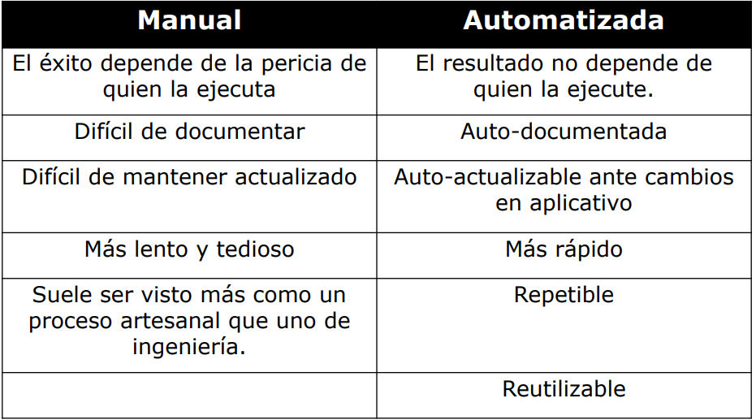

# Parcialito nro 3 Técnicas de Documentación y Validación
## Swagger
Herramienta para documentar APIs, además es posible generar pruebas manuales desde la documentación. Swagger utiliza **OpenAPI**, que es un formato de códgio abierto para describir y documentar APIs, permite definiciones escritas en YAML y JSON.

#### Ejemplo
```java
openapi: 3.0.0
info:
  version: 1.0.0
  title: API Clubes
  description: API para obtener información sobre socios de una entidad Social y Deportiva
paths:
  /list:
    get:
      summary: Retorna una lista de socios
      responses:
        '200':
          description: Lista de socios fue obtenida
          content:
            application/json:
              schema:
                type: array
                items:
                  type: object
                  required:
                    - idsocio
                  properties:
                    nombre:
                      type: string
                    apellido:
                      type: string
                    edad:
                      type: integer
                    dni:
                      type: string
        '400':
          description: Consulta invalida
          content:
            application/json:
              schema:
                type: object
                properties:
                  mensaje:
                    type: string
```

### Parameters
Se deben especificar:
- Nombre (name)
- Ubicación (location (in))
- Tipo del dato (definido en schema o content)
- Otros:
    - Descripción (description)
    - Obligatorio (required)

#### Parámetros de Ruta
- **in: path**
- Son variables en la url utilizados para identificar un elemento de la colección.
- Se indican con {}
```java
paths:
  /socios/{idSocio}
    get:
      summary: Obtiene socio por su ID
      parameters:
        - in: path
          name: idSocio
          schema:
            type: integer
          required: true
          description: ID numerico del socio a obtener
```

#### Parámetros de Consulta
- **in: query**
- Se utilizan para flexibilizar la consulta concatenando criterios.
- Aparecen al final de la url luego de un (?)
- Los criterios se separan con (&)
```java
paths:
  /socios?contiene=Carl&edadLimite=30
    get:
      parameters:
        - in: query
          name: contiene
          schema:
            type: string
          description: contenido parcial
        - in: query
          name: edadLimite
          schema:
            type: string
          description: Edad límite a buscar
```

#### Modificadores
```java
parameters:
  - in: query
    name: edad
    schema:
      type: integer
      minimum: 0
      maximum: 100
      default: 16
    required: false
    description: Edad del socio
```

```java
parameters:
  - in: query
    name: plan
    schema:
      type: integer
      enum:
        - estandar
        - familiar
        - premium
```

```java
parameters:
  - in: query
    name: idActividad
    schema:
      type: integer
      format: int32
      nullable: true
```

```java
parameters:
  - in: query
    name: edad
    schema:
      type: integer
      minimum: 0
      example: 20
```

### Request Body
- Usados en métodos:
    - POST
    - PUT
    - PATCH
- Se describe en el objeto requestBody

```java
paths:
  /socios/:
    post:
      summary: Da de alta un socio
      requestBody:
        required: true
        content:
          application/json:
            schema:
              type: object
              required:
                - nombre
                - apellido
                - edad
              properties:
                nombre:
                  type: string
                apellido:
                  type: string
                edad:
                  type: integer
```

### Componentes reusables
Se pueden definir componentes para utilizarlos en diferentes endpoints.
- Schemas
- Parameters
- Request Bodies
- Responses
- Responde Headers
- Examples
- Links
- Callbacks

#### Componentes reusables - Schemas
```java
components:
  schemas:
    Socio:
      type: object
      required:
        - nombre
        - apellido
      properties:
        nombre:
          type: string
        apellido:
          type: string
        edad:
          type: integer
```

```java
responses:
  '200':
    description: Se retorna la lista de socios
    content:
      application/json:
        schema:
          type: array
          items:
            $ref: '#/components/schemas/Socio'
```

### Componentes reusables - Parameters
```java
components:
  parameters:
    FiltroSocio:
      name: idSocio
      in: query
      description: Socio a buscar
      schema:
        type: integer
```

```java
paths:
  /Socios:
    get:
      summary: Retornau¿ uno o mas socios
      parameters:
        - $ref: '#/components/parameters/FiltroSocio'
```

## Postman
- Es una herramienta escalable para testeo de APIs.
- Permite el uso de colecciones (equivalentes a test suides).
- Permite definición de entornos.
- Permite creación de tests.

**Ejemplo de Test en Postman.** Test para verificar que devuelve un 200.
```javascript
pm.test("Status code is 200", () => {
    pm.response.to.have.status(200);
})
```

## Automation
La automatización es el uso de software para controlar la ejecución de pruebas. Es una técnica complementaria al testing manual.

**¿Cuando automatizar?**
- Tests que deben ser ejecutados cada vez que la aplicación bajo prueba sea modificada.
- Tests que utilizan múltiples valores de datos para los mismos casos.
- Tests qie requieren información detallada de los estados internos del sistema.
- Tests de stress o carga.
- Generación de datos de prueba.
- Test que deben ser ejecutados en varios ambientes.

**¿Cuando no automatizar?**
- Test de usabilidad.
- Test que se ejecutarán una única vez.
- Tests sin resultados predecibles.
- Aplicaciones inestables.
- Análisis de ROI no favorable.

**Diferencias entre Test Manual y Test Automatizado**


**Beneficios de Automatizar Tests**
- Ahorro de tiempo y esfuerzo.
- Verificar que los errores pasados no se reproduzcan.
- Ahorro en gasto de personal.
- Ahorro en costos de ciclo de vida del testing.
- Mejora la productividad.

### Locators
Clave alfanúmerica de búsqueda e identificación de un elemento.

### Estrategias de Automation
- **Record and Playback**: Selenium IDE, SIKULI.
- **Data-Driven Testing**: TestNG.

### Selenium WebDriver
- Esta diseñado para proveer una simple y mas concisa interface de programación.
- Fue desarrollado para un mejor soporte de web pages dinámicas donde los elementos de las páginas pueden cambiar sin que la página sea recargada.

#### Assert y Verify
- **Assert** Evalúa una condición, si esa condición no es verdadera, falla el test y se detiene.
- **Verify** Evalúa una condición, si esa condición no es verdadera, marca el test como fallido, pero continúa con la ejecución del test.

#### Locators
Métodos que te permiten encontrar y manipular elementos en una página web. Los principales son:
- ID
- Name
- Class Name
- Tag Name
- Link Text
- Partial Link
- Css Selector
- XPath

### Patron Page object
- Los elementos de una página web interactuan con el código de test mediante objetos.
- Los métodos públicos representan los servicios que la página ofrece.
- No exponer el funcionamiento interno de la página.
- Mejor mantenibilidad.
- Mejor legibilidad.